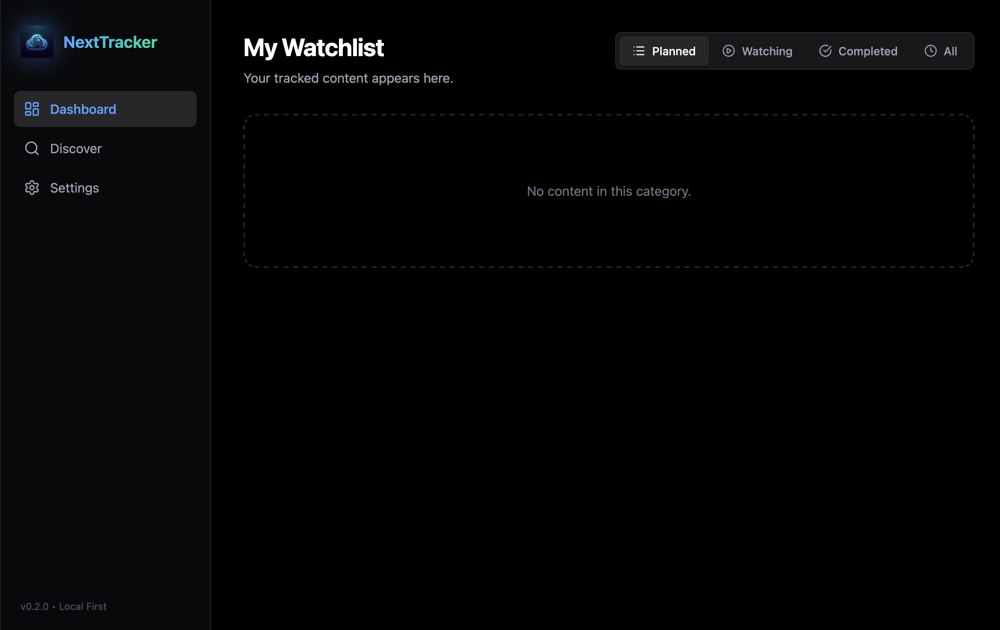

# NextTracker

NextTracker is a modern, privacy-focused application for tracking movies and series. It uses a **Local-First** architecture, meaning your data stays on your device, with optional synchronization to your personal **Nextcloud** server.

 


## 🚀 Features

- **Local-First & Fast:** Uses IndexedDB (Dexie.js) for instant page loads and offline support. No internet required for basic usage.
- **Privacy Focused:** Your data is yours. No third-party tracking or cloud lock-in.
- **Nextcloud Sync:** Securely backup and sync your data with your personal Nextcloud server via WebDAV.
- **TMDB Integration:** Search and add movies/series with automatic metadata fetching (Posters, Overview, Release Date).
- **Modern UI:** Built with React, TailwindCSS v4, and Lucide Icons for a sleek experience.
- **Progressive Web App (PWA) Ready:** Capable of being installed on devices (future roadmap).

## 🛠️ Technology Stack

- **Framework:** [React](https://react.dev/) + [Vite](https://vitejs.dev/)
- **Language:** [TypeScript](https://www.typescriptlang.org/)
- **Styling:** [TailwindCSS v4](https://tailwindcss.com/)
- **Database:** [Dexie.js](https://dexie.org/) (IndexedDB Wrapper)
- **Icons:** [Lucide React](https://lucide.dev/)
- **Sync:** [WebDAV](https://github.com/perry-mitchell/webdav-client)

## 📦 Installation

1.  Clone the repository:
    ```bash
    git clone https://github.com/androtuna/next-tracker.git
    cd next-tracker
    ```

2.  Install dependencies:
    ```bash
    npm install
    ```

3.  Start the development server:
    ```bash
    npm run dev
    ```

## ⚙️ Configuration

### TMDB API
To use the search functionality, you need a TMDB API Key (v3).
1.  Go to [The Movie Database](https://www.themoviedb.org/) and create an account.
2.  Get your API Key from Settings > API.
3.  In NextTracker, go to **Settings** and enter your key.

### Nextcloud Sync
To enable sync:
1.  Go to **Settings**.
2.  Enter your Nextcloud WebDAV URL (usually ends with `/remote.php/dav/files/USERNAME/`).
3.  Enter your Username and App Password.

## 🤝 Contributing

Contributions are welcome! Please feel free to submit a Pull Request.

## 📄 License

This project is licensed under the MIT License.
